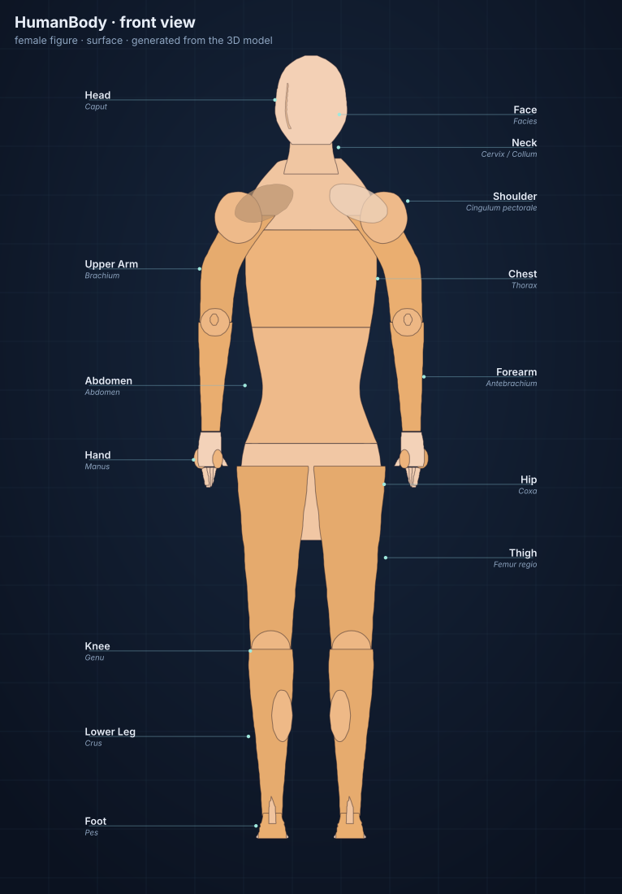
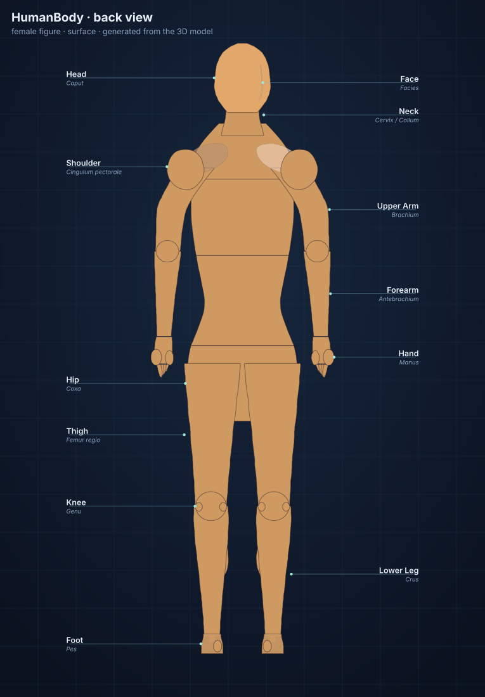
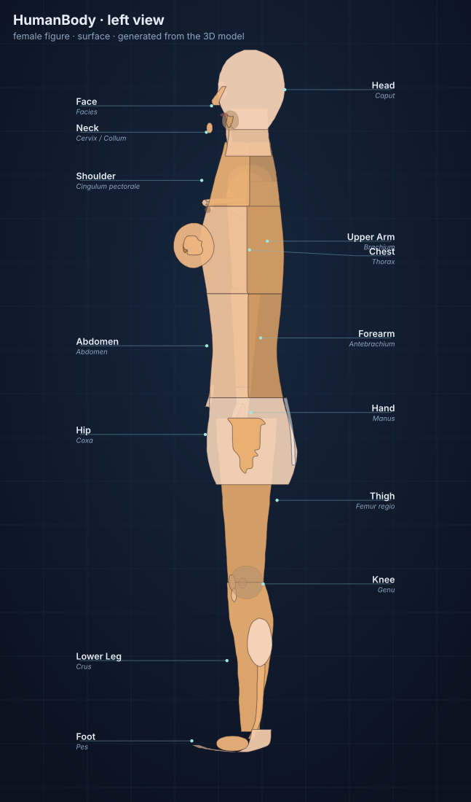
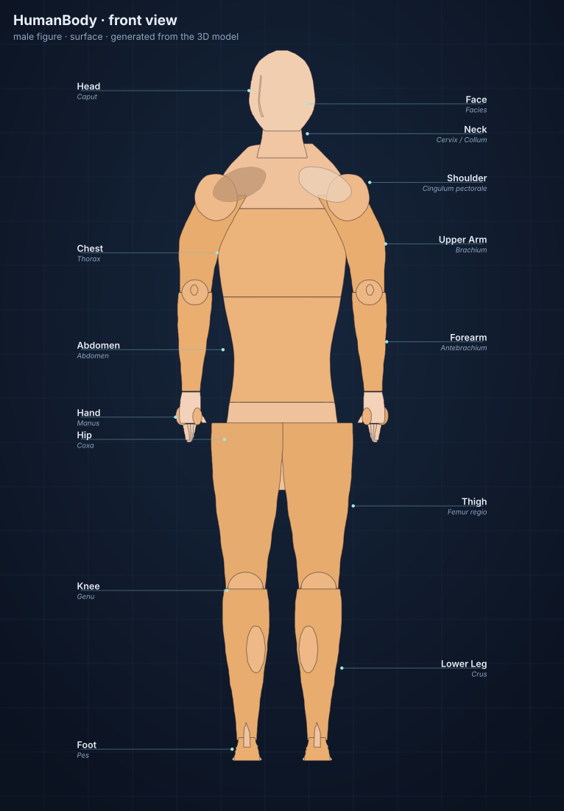

# 🧍 HumanBody 3D

An interactive, open-source 3D atlas of the human body — one model you can read at any age.
Point at a knee in Class 1 and learn what it does; open the same knee at PhD level and read about
chondrocyte mechanotransduction, zonal collagen architecture and osteoarthritis as failed repair.

**[Live demo →](https://Kyabtao.github.io/HumanBody/)** (available once GitHub Pages is enabled — see [Deploy](#deploy-to-github-pages))

---

## What's inside

| | |
|---|---|
| **156** | anatomy entries, from "Head" to "Telomere attrition" |
| **13** | systems: surface regions, skeletal, muscular, nervous, cardiovascular, respiratory, digestive, urinary, endocrine, lymphatic/immune, reproductive, integumentary and the microscopic world |
| **1,000+** | 3D meshes generated procedurally in code (no external model files, no downloads) |
| **22** | microscopic models — cell, nucleus, mitochondria, DNA, nephron, alveoli, villi, osteon, neuron, placenta, reflex arc, feedback loops … |
| **5** | learning levels, each rewriting every explanation |
| **5** | guided tours and an endless self-testing quiz |
| **2** | views of the same body: the rotatable **3D model** and a flat, zoomable, printable **2D plate** |

### Five levels, one body

| Level | Called | What you get |
|---|---|---|
| **1** | Class 1–5 · *My Body* | The outside of the body, the senses, what the big organs do for you, healthy habits |
| **2** | Class 6–8 · *Body Systems* | All eleven organ systems, major bones and muscles, circulation, breathing, digestion |
| **3** | Class 9–10 · *Organs in Depth* | Structure, relations, blood and nerve supply; nephron, alveolus, villus, osteon |
| **4** | Undergraduate / MBBS | Regional anatomy, origin–insertion–nerve–action, dermatomes, physiology and control |
| **5** | MD / PhD | Histology and ultrastructure, signalling pathways, embryology, imaging, open questions |

The 3D scene changes with the level too: gross structures first, finer branches (coronary arteries,
heart valves, bronchi, meninges, islets, sympathetic chain) appear as you move up, and the
**microscopic world** unlocks from level 4.

### 3D and 2D, from one model

Switch with the segmented control in the top bar (or press **P**). Both views are the *same*
figure, so every filter you set — level, systems, x-ray, isolation — applies to both.

| | |
|---|---|
| **🧍 3D** | orbit, zoom, slice, x-ray, hover-pick any structure; studio lighting with a soft contact shadow and a small idle sway |
| **🖼 2D** | a flat anatomical plate **projected from the live meshes** — silhouette loops are traced per structure, shaded by their real normals, and laid out with leader-line labels. Drag to pan, scroll to zoom, click a region to open it, and save the plate as **SVG** (vector, prints at any size) or **PNG** |

The 2D plate is also the fallback when WebGL is unavailable: the app opens straight into it,
so the atlas still works on a locked-down school laptop.

<table>
  <tr>
    <td></td>
    <td></td>
    <td></td>
    <td></td>
  </tr>
  <tr><td colspan="4"><sub>Generated by <code>npm run plate</code> into <code>public/atlas/</code> — the files above are real, current output, not screenshots.</sub></td></tr>
</table>

### Things to try

- **Click anything.** Hover for a label, click for a full explanation with a "zoom to it" button.
- **Peel the body.** Turn systems on and off, hit **🩻 X-ray** to fade the skin, or **✂️ Slice** to cut through it.
- **🔬 Micro view.** From level 4, open a part and dive into a 3D cell, a nephron, an alveolus or a DNA helix.
- **🎯 Quiz.** Generated from the real atlas text, at your level, on one system or the whole body.
- **🎒 Tour.** A scripted lesson per level that flies the camera and narrates as it goes.
- **♀ / ♂ + complexion.** The body-type switch changes the skeleton-wide proportions (shoulder
  and pelvis widths, waist, bust, jaw, hair length), not just the reproductive organs; five
  complexion swatches retint skin, lips, nails and hair.
- **🖼 2D plate.** Press **P** for the flat view; **L** toggles its labels; the toolbar saves it as SVG or PNG.
- **Search** (`/`) • **1–5** levels • **P** 2D/3D • **X** x-ray • **R** reset view • **Esc** close.

---

## Run it locally

```bash
git clone https://github.com/Kyabtao/HumanBody.git
cd HumanBody
npm install
npm run dev      # http://localhost:5173
```

```bash
npm run build    # static site → dist/
npm run preview  # serve the built site
npm run check    # validate the atlas: content, 3D model, levels, quiz, tours, 2D plates
npm run plate    # regenerate the flat plates in public/atlas/ (--views front,back --systems surface,skeletal)
```

`npm run check` is a headless self-test: it verifies that every entry has text for every level,
that every mesh, tour step and search result resolves, that internal organs stay inside the body
envelope, that quizzes can be built at each level, and that every 2D plate projects cleanly for
both body types. It exits non-zero on failure, so it fits straight into CI.

Requires Node 18+. The only runtime dependency is [three.js](https://threejs.org/).

---

## Deploy to GitHub Pages

Ready-made GitHub Actions workflows live in `deploy/`. Install them with:

```bash
npm run setup-pages     # copies deploy/*.yml into .github/workflows/
git add .github && git commit -m "Add Pages workflows" && git push
```

(`deploy/github-pages.yml` builds `dist/` and publishes it to Pages on every push to `main`;
`deploy/pr-build.yml` just verifies that pull requests still build.)

Then, once, in the repository settings:

**Settings → Pages → Build and deployment → Source → GitHub Actions**

Your site appears at `https://<your-username>.github.io/HumanBody/`.

`vite.config.js` uses `base: './'`, so the same build works on a project sub-path, on a custom
domain, or straight from a folder on any static host (Netlify, Vercel, S3, `python -m http.server`).

---

## Project layout

```
index.html                  markup shell
src/
  main.js                   app: panels, search, quiz, tour, keyboard
  styles.css                interface styling
  quiz.js                   question generation from the atlas text
  data/
    levels.js               the five learning levels
    systems.js              the thirteen systems
    tours.js                guided lessons per level
    parts/*.js              the anatomy content (one file per system)
    index.js                aggregation + search
  atlas/
    plate.js                3D → 2D projection: silhouette tracing, shading, labels, SVG
    stage2d.js              the interactive 2D stage (pan, zoom, pick, export)
  scene/
    anatomy.js              shared measurement tables: proportions, trunk/head/limb lofts, tones
    materials.js            procedural skin (pores, mottling, sheen, clearcoat) and hair/nails
    helpers.js              landmarks, materials, geometry helpers
    humanoid.js             assembles the systems, part registry, micro registry
    viewer.js               renderer, camera, picking, micro view, animation
    builders/
      surface.js            body figure + skin, hair, glands
      skeletal.js           skull, spine, ribs, limbs, joints
      muscular.js           muscle groups, diaphragm, tendons
      nervous.js            brain, cord, nerves, eye, ear, nose, tongue
      cardiovascular.js     heart, aorta, vessels
      organs.js             respiratory, digestive, urinary, endocrine, lymphatic, reproductive
      micro.js              cells, organelles, tissues, DNA, placenta, reflex arc
```

### How the body is drawn

There are no downloaded model files. Every bone, organ and vessel is generated in JavaScript from
primitives — lathes for tapered limbs, tubes along curves for vessels and gut, displaced
icosahedra for organs, and procedural gyri on the brain. That keeps the whole atlas
**~1 MB gzipped**, offline-capable and easy to edit: change a number in `src/scene/helpers.js`
and the anatomy moves.

Coordinates are in metres on one shared frame (feet at `y = -0.90`, crown at `y ≈ +0.91`),
documented in `src/scene/helpers.js`.

The soft parts are **lofted**, not boxed: `src/scene/anatomy.js` holds cross-section tables
(trunk rings from pelvis to shoulders, neck, ten head sections, limb profiles, palm and finger
lengths), and `loftGeometry` sweeps ellipsoid rings between them with correct winding, shared
boundary rings between neighbouring bands (so no seams or z-fighting) and a Lambert term that
biases each cross-section's centre forward, back, left or right — which is how the chest leans
into the breasts, the back bulges over the scapulae, and the abdomen overhangs the pubis.
Because the 3D figure and the 2D plate read the same tables, retuning a number fixes both views
at once.

### Adding content

Append an entry to the right file in `src/data/parts/`:

```js
P('part-id', 'Display Name', {
  latin: 'Nomen anatomicum',
  minLevel: 3,                 // first level at which it appears
  tags: ['organ'],
  details: {
    basic: '…for a six-year-old…',
    middle: '…school level…',
    high: '…senior school…',
    undergrad: '…medical school…',
    phd: '…histology, molecules, open questions…',
  },
  facts: ['A memorable number.'],
});
```

It becomes searchable, quiz-able and visible in the parts list straight away. To give it a 3D
shape, add meshes with the same id in the matching builder; to give it a microscopic model, add a
`model('part-id')` group in `src/scene/builders/micro.js`.

---

## Scope and honesty

This is a teaching model, not a medical device. The anatomy is **stylised**: proportions and
shapes are correct in outline (laterality, levels and relations follow standard anatomy) but
simplified, and it is not patient-specific. Always consult a clinician for medical decisions.

## License

MIT — see [LICENSE](LICENSE). Built with [three.js](https://threejs.org/) (MIT).
